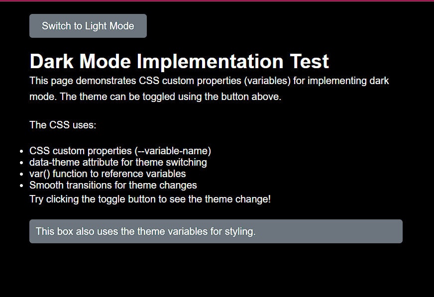
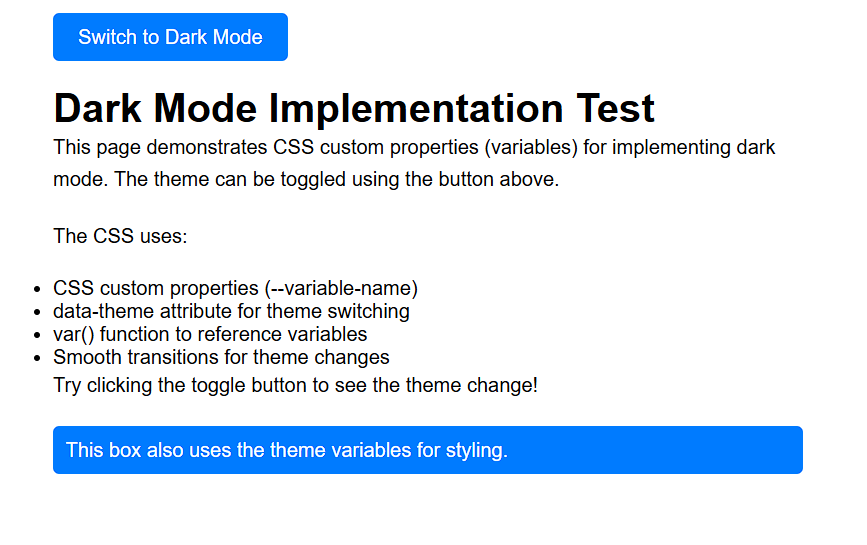

# CSS Advanced Topics

This file provides an overview of advanced CSS concepts. Click the links below for detailed documentation on each topic.

## Animations and Transitions

### CSS Animations
CSS animations create smooth, automated movements and property changes using `@keyframes` rules. Perfect for loading spinners, visual effects, and interactive elements.

**See detailed guide:** [CSS Animations](css_animation.md)

Key features:
- @keyframes rule definition
- Multiple animation properties
- Timing functions and delays
- Complex multi-stage animations

### CSS Transitions
Transitions smoothly change property values over time when triggered by state changes (e.g., hover). Simpler than animations but powerful for interactive effects.

**See detailed guide:** [CSS Transitions](css_transition.md)

Key features:
- transition-property
- transition-duration
- Timing functions
- Delay control

## What's the difference between transition and animation in CSS?
- **Transitions**: Triggered by state changes (hover, focus, etc.), run once, simple property changes
- **Animations**: Run automatically or on trigger, can loop infinitely, support complex multi-step sequences with @keyframes

Use transitions for simple hover effects, animations for complex sequences.

### CSS Transforms
Transforms change element shape, size, position, and rotation in 2D or 3D space without affecting document flow.

**See detailed guide:** [CSS Transformations](css_transformation.md)

Key methods:
- `translate()` - Move elements
- `rotate()` - Rotate elements
- `scale()` - Resize elements
- `skew()` - Distort elements
- 3D transforms (rotateX, rotateY, rotateZ)

---

## Responsive and Layout

### CSS Media Queries
Media queries apply different CSS rules based on device characteristics (screen size, orientation, resolution) to create responsive designs.

**See detailed guide:** [CSS Media Queries](css_media_queries.md)

Key concepts:
- Device breakpoints (600px, 768px, 992px, 1200px)
- Media types (screen, print, speech)
- Orientation queries (landscape, portrait)
- Feature queries (width, height, color)

### CSS Responsive Design
Responsive design combines media queries, flexible layouts, and fluid images to adapt websites to any screen size.

Key principles:
- Mobile-first approach
- Flexible grid layouts
- Responsive images
- Appropriate typography

---

## Advanced Styling

### CSS Variables (Custom Properties)
CSS variables store reusable values that can be referenced throughout your stylesheets, making maintenance easier and enabling dynamic theming.

Syntax: `--variable-name: value;` and `var(--variable-name)`

### CSS Specificity
Specificity determines which CSS rule applies when multiple rules target the same element. 

Calculation: `(IDs, Classes & Attributes, Elements)`

## What is the !important rule in CSS, and when should you avoid it?
`!important` overrides all other declarations and gives a rule the highest specificity. It should be avoided because:

- Breaks natural cascade and specificity
- Makes debugging difficult
- Creates maintenance issues
- Should only be used as last resort for third-party CSS overrides

Example: `color: red !important;`

### CSS Inheritance
Inheritance allows certain properties to be inherited from parent elements to child elements (e.g., font, color).

### CSS Cascade
Cascade determines style priority:
1. Inline styles (highest)
2. External and internal stylesheets
3. Browser defaults (lowest)

## CSS Debugging

### How do you debug layout issues in CSS?
1. **Inspect elements** using browser dev tools
2. **Check box model** values (margin, padding, border)
3. **Verify positioning** and z-index
4. **Test responsive behavior** with different screen sizes
5. **Use CSS reset/normalize** to eliminate browser defaults
6. **Validate HTML structure** for proper nesting
7. **Check for CSS conflicts** using specificity rules

### How do browser dev tools help you in debugging CSS issues?
Browser dev tools provide:
- **Element inspection** with live CSS editing
- **Box model visualization** showing computed dimensions
- **Style cascade view** showing applied rules and overrides
- **Responsive design testing** with device emulation
- **Performance analysis** for animations and layouts
- **Console errors** for invalid CSS
- **Network tab** for stylesheet loading issues

## CSS Theming

### How do you implement dark mode in CSS?
Use CSS custom properties (variables) and media queries or class toggling:

**HTML for testing:**
```html
<!DOCTYPE html>
<html lang="en">
<head>
    <meta charset="UTF-8">
    <meta name="viewport" content="width=device-width, initial-scale=1.0">
    <title>Dark Mode Test</title>
    <style>
        :root {
            --bg-color: white;
            --text-color: black;
            --button-bg: #007bff;
            --button-text: white;
        }

        [data-theme="dark"] {
            --bg-color: black;
            --text-color: white;
            --button-bg: #6c757d;
            --button-text: white;
        }

        body {
            background: var(--bg-color);
            color: var(--text-color);
            font-family: Arial, sans-serif;
            padding: 20px;
            transition: background 0.3s, color 0.3s;
        }

        .container {
            max-width: 600px;
            margin: 0 auto;
        }

        h1 {
            color: var(--text-color);
        }

        p {
            line-height: 1.6;
            margin-bottom: 20px;
        }

        button {
            background: var(--button-bg);
            color: var(--button-text);
            border: none;
            padding: 10px 20px;
            border-radius: 5px;
            cursor: pointer;
            font-size: 16px;
            transition: background 0.3s;
        }

        button:hover {
            opacity: 0.8;
        }

        .theme-toggle {
            margin-bottom: 20px;
        }
    </style>
</head>
<body>
    <div class="container">
        <div class="theme-toggle">
            <button id="theme-toggle">Toggle Dark Mode</button>
        </div>

        <h1>Dark Mode Implementation Test</h1>

        <p>This page demonstrates CSS custom properties (variables) for implementing dark mode. The theme can be toggled using the button above.</p>

        <p>The CSS uses:</p>
        <ul>
            <li>CSS custom properties (--variable-name)</li>
            <li>data-theme attribute for theme switching</li>
            <li>var() function to reference variables</li>
            <li>Smooth transitions for theme changes</li>
        </ul>

        <p>Try clicking the toggle button to see the theme change!</p>

        <div style="background: var(--button-bg); color: var(--button-text); padding: 10px; border-radius: 5px;">
            This box also uses the theme variables for styling.
        </div>
    </div>

    <script>
        const themeToggle = document.getElementById('theme-toggle');
        const html = document.documentElement;

        // Check for saved theme preference or default to light mode
        const currentTheme = localStorage.getItem('theme') || 'light';
        html.setAttribute('data-theme', currentTheme === 'dark' ? 'dark' : 'light');

        // Update button text based on current theme
        themeToggle.textContent = currentTheme === 'dark' ? 'Switch to Light Mode' : 'Switch to Dark Mode';

        themeToggle.addEventListener('click', () => {
            const currentTheme = html.getAttribute('data-theme');
            const newTheme = currentTheme === 'dark' ? 'light' : 'dark';

            html.setAttribute('data-theme', newTheme);
            localStorage.setItem('theme', newTheme);

            // Update button text
            themeToggle.textContent = newTheme === 'dark' ? 'Switch to Light Mode' : 'Switch to Dark Mode';
        });
    </script>
</body>
</html>
```


**CSS Variables Approach:**

Or using prefers-color-scheme:
```css
@media (prefers-color-scheme: dark) {
  body {
    background: black;
    color: white;
  }
}
```

Toggle with JavaScript: `document.documentElement.setAttribute('data-theme', 'dark');`

---

## Advanced Selectors

### CSS Pseudo-Classes
Pseudo-classes target elements in specific states or positions without adding HTML classes.

Examples: `:hover`, `:focus`, `:active`, `:nth-child()`, `:first-child`, `:last-child`

### CSS Pseudo-Elements
Pseudo-elements target specific parts of elements.

Examples: `::before`, `::after`, `::first-line`, `::first-letter`, `::selection`

---

## Browser Compatibility

### CSS Vendor Prefixes
Vendor prefixes like `-webkit-`, `-moz-`, `-ms-` ensure CSS features work in different browsers during their standardization phase.

Example: `-webkit-transform: rotate(45deg);`

### CSS Preprocessing
CSS preprocessors like Sass, Less, and Stylus extend CSS with variables, nesting, and mixins, then compile to standard CSS.

### CSS Postprocessing
Postprocessors like Autoprefixer automatically add vendor prefixes and optimize CSS for better browser compatibility.

---

## Frameworks & Libraries

### CSS Frameworks
Pre-built CSS frameworks like Bootstrap, Tailwind CSS, and Foundation provide ready-made components, utilities, and layouts to speed up development.

---

## Navigation Guide

- **[Main CSS Guide](css.md)** - Introduction to CSS
- **[CSS Basics](Css_Basics.md)** - Selectors, syntax, and fundamentals
- **[CSS Layout](Css_Layout.md)** - Display, position, and layout methods
- **[Box Model](box_model.md)** - Margins, padding, borders
- **[Text Formatting](text_formatting.md)** - Text properties and styling
- **[Backgrounds](css_background.md)** - Background colors and images
- **[Gradients](css_gradient.md)** - Color gradients
- **[Flexbox](css_flexbox.md)** - Flexible box layout details
- **[Grid](css_grid.md)** - CSS Grid layout details
- **[Animations](css_animation.md)** - @keyframes and animation properties
- **[Transitions](css_transition.md)** - Smooth property transitions
- **[Transformations](css_transformation.md)** - 2D and 3D transforms
- **[Media Queries](css_media_queries.md)** - Responsive design queries