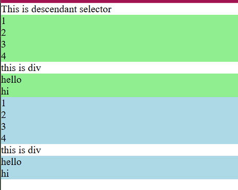
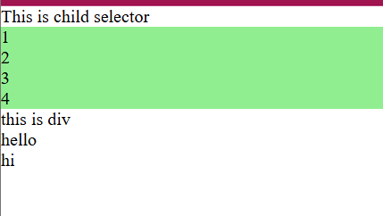
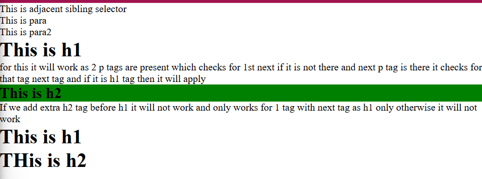
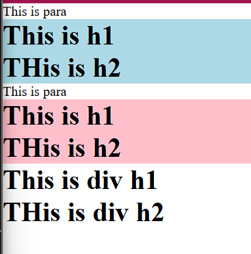
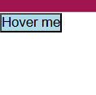
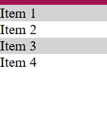
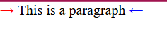
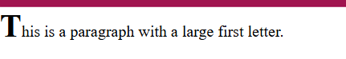
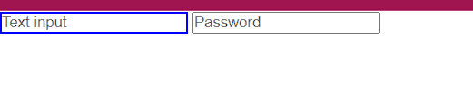
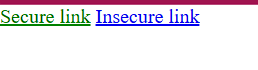

# CSS Basics

## What is CSS Syntax?
CSS rules consist of a selector and a declaration block:
```css
selector {
  property: value;
}
```

## What are CSS Selectors?
Selectors target HTML elements to apply styles.
There are 5 types of selector:
1) Simple
2) Combinator
3) Pseudo element
4) Pseudo class
5) Attribute 

## What are simple selectors?
1) id(#) - Used to give styles to a particular element
2) class(.) - Used to select the same styles for many elements
3) Group selector(,) - Used to select more than one element
4) Universal selector(*) - Used to select all elements universally
5) Element selector (Tagname) - Used to select specific HTML tags
<!-- - Element: `p`
- Class: `.classname`
- ID: `#idname`
- Universal: `*`
- Attribute: `[type="text"]`
- Pseudo-class: `:hover`
- Pseudo-element: `::before` -->

## What are combinator selectors?
1) Descendent selector (space in between):
Example: 
```html
<!DOCTYPE html>
<html lang="en">
<head>
    <meta charset="UTF-8">
    <meta name="viewport" content="width=device-width, initial-scale=1.0">
    <title>Document</title>
    <link rel="stylesheet" href="comb_style.css">
</head>
<body>
This is descendant selector
    <section>
        <article>1</article>
        <article>2</article>
        <article>3</article>
        <article>4</article>
        <div>this is div</div>
        <div>
            <article>hello</article>
            <article>hi</article>
        </div>
    </section>
    <section id="first">
        <article>1</article>
        <article>2</article>
        <article>3</article>
        <article>4</article>
        <div>this is div</div>
        <div>
            <article>hello</article>
            <article>hi</article>
        </div>
    </section>
</body>
</html>
```
```css
#second article{
    background-color: lightblue;
}
#first article{
    background-color: lightgreen;
}
```
output:


*Figure: In the image as you can see all the descendent irrlevant of if ist just a child or grandchild it is geeting highlighted*<br>
2) Child selector(>):
Example: 
```html
<!DOCTYPE html>
<html lang="en">
<head>
    <meta charset="UTF-8">
    <meta name="viewport" content="width=device-width, initial-scale=1.0">
    <title>Document</title>
    <link rel="stylesheet" href="comb_style.css">
</head>
<body>
This is child selector  
    <section id="first">
        <article>1</article>
        <article>2</article>
        <article>3</article>
        <article>4</article>
        <div>this is div</div>
        <div>
            <article>hello</article>
            <article>hi</article>
        </div>
    </section>
</body>
</html>
```
```css
#first > article{
    background-color: lightgreen;
}
```
output:


*Figure: In the image as you can see the immdiate child is getting highlighted and not others*<br>
3) Adjacent sibling selector(+):
Example: 
```html
<!DOCTYPE html>
<html lang="en">
<head>
    <meta charset="UTF-8">
    <meta name="viewport" content="width=device-width, initial-scale=1.0">
    <title>Document</title>
    <link rel="stylesheet" href="comb_style.css">
</head>
<body>
    This is adjacent sibling selector
    <section>
        <p>This is para</p>
        <p>This is para2</p> 
        <h1>This is h1</h1>
        for this it will work as 2 p tags are 
         present which checks for 1st next if it is 
         not there and next p tag is there it checks 
         for that tag next tag and if it is h1 tag then it will apply
        <h2>This is h2</h2>
         If we add extra h2 tag before h1 it will 
          not work and only works for 1 tag with next tag 
          as h1 only otherwise it will not work
        <h1>This is h1</h1> 
         <h1>THis is h2</h1>
    </section>
</body>
</html>
```
```css
section > p + h2{
    background-color: green;
}
```
output:


*Figure: In the image it only selects the next one sibling of p only if p are 2 it will considers the second p next sibling and highlight it*<br>
4) General sibling selector(~):
Example: 
```html
<!DOCTYPE html>
<html lang="en">
<head>
    <meta charset="UTF-8">
    <meta name="viewport" content="width=device-width, initial-scale=1.0">
    <title>Document</title>
    <link rel="stylesheet" href="comb_style.css">
</head>
<body>
This is general sibling selector 
    <section id="first1">
        <p>This is para</p>
        <h1>This is h1</h1>
        <h1>THis is h2</h1>
    </section>
    <section id="second">
        <p>This is para</p>
        <h1>This is h1</h1>
        <h1>THis is h2</h1>
        <div>
            <h1>This is div h1</h1>
            <h1>THis is div h2</h1>
        </div>
    </section>
</body>
</html>
```
```css
#first1 > p ~ h1{
    background-color: lightblue;
}
#second > p ~ h1{
    background-color: pink;
}
```
output:


*Figure: In the image it only selects the next all siblings of p only if p are 2 it will considers the second p next siblings and highlight it*

## What are pseudo-class selectors?
Pseudo-class selectors style elements based on their state or position.
Common pseudo-classes:
1) :hover - When mouse is over element
2) :active - When element is being clicked
3) :focus - When element has focus
4) :visited - For visited links
5) :first-child - First child of parent
6) :last-child - Last child of parent
7) :nth-child(n) - Nth child of parent
8) :not(selector) - Elements not matching selector

Example for :hover:
```html
<!DOCTYPE html>
<html lang="en">
<head>
    <meta charset="UTF-8">
    <meta name="viewport" content="width=device-width, initial-scale=1.0">
    <title>Document</title>
    <style>
        button:hover {
            background-color: lightblue;
        }
    </style>
</head>
<body>
    <button>Hover me</button>
</body>
</html>
```
Output: 
Button changes color on hover.

Example for :nth-child:
```html
<!DOCTYPE html>
<html lang="en">
<head>
    <meta charset="UTF-8">
    <meta name="viewport" content="width=device-width, initial-scale=1.0">
    <title>Document</title>
    <style>
        li:nth-child(odd) {
            background-color: lightgray;
        }
    </style>
</head>
<body>
    <ul>
        <li>Item 1</li>
        <li>Item 2</li>
        <li>Item 3</li>
        <li>Item 4</li>
    </ul>
</body>
</html>
```
Output: 
Alternating background colors for list items.

## What are pseudo-element selectors?
Pseudo-element selectors style specific parts of elements.
Common pseudo-elements:
1) ::before - Inserts content before element
2) ::after - Inserts content after element
3) ::first-line - Styles first line of text
4) ::first-letter - Styles first letter of text
5) ::selection - Styles selected text

Example for ::before and ::after:
```html

```
Output: 
Paragraph with arrows before and after.

Example for ::first-letter:
```html
<!DOCTYPE html>
<html lang="en">
<head>
    <meta charset="UTF-8">
    <meta name="viewport" content="width=device-width, initial-scale=1.0">
    <title>Document</title>
    <style>
        p::first-letter {
            font-size: 2em;
            font-weight: bold;
        }
    </style>
</head>
<body>
    <p>This is a paragraph with a large first letter.</p>
</body>
</html>
```
Output: 
First letter is larger and bold.

## What are attribute selectors?
Attribute selectors target elements based on their attributes.
Common attribute selectors:
1) [attr] - Elements with attribute
2) [attr=value] - Elements with exact attribute value
3) [attr~=value] - Elements with attribute containing word
4) [attr|=value] - Elements with attribute starting with value followed by hyphen
5) [attr^=value] - Elements with attribute starting with value
6) [attr$=value] - Elements with attribute ending with value
7) [attr*=value] - Elements with attribute containing value

Example for [type="text"]:
```html
<!DOCTYPE html>
<html lang="en">
<head>
    <meta charset="UTF-8">
    <meta name="viewport" content="width=device-width, initial-scale=1.0">
    <title>Document</title>
    <style>
        input[type="text"] {
            border: 2px solid blue;
        }
    </style>
</head>
<body>
    <input type="text" placeholder="Text input">
    <input type="password" placeholder="Password">
</body>
</html>
```
Output: 
Text input has blue border, password does not.

Example for [href^="https"]:
```html
<!DOCTYPE html>
<html lang="en">
<head>
    <meta charset="UTF-8">
    <meta name="viewport" content="width=device-width, initial-scale=1.0">
    <title>Document</title>
    <style>
        a[href^="https"] {
            color: green;
        }
    </style>
</head>
<body>
    <a href="https://example.com">Secure link</a>
    <a href="http://example.com">Insecure link</a>
</body>
</html>
```
Output: 
HTTPS links are green.

## What are CSS Colors?
Colors can be specified as:
- Named: `red`, `blue`
- Hex: `#ff0000`
- RGB: `rgb(255, 0, 0)`
- RGBA: `rgba(255, 0, 0, 0.5)`
- HSL: `hsl(0, 100%, 50%)`

## What are CSS Fonts?
Font properties:
- `font-family`: Specifies the font
- `font-size`: Size of the font
- `font-weight`: Boldness
- `font-style`: Italic
- `line-height`: Line spacing

## What is CSS Background?
Background properties:
- `background-color`: Background color
- `background-image`: Background image
- `background-repeat`: Repeat pattern
- `background-position`: Position
- `background-size`: Size


## What is CSS Specificity?
Specificity determines which CSS rule is applied. Higher specificity wins.
- Inline styles: 1000
- ID: 100
- Class/Pseudo-class: 10
- Element: 1

## What is CSS Inheritance?
Some properties are inherited from parent to child elements, like `color`, `font-family`.

## What are CSS Units?
- Absolute: px(static measure we can give parent tagecant give), cm, mm, in, pt, pc
- Relative: %(Height wont be considered), em(element size, basic takes the parents size), rem(root element size(16px) default body), vw, vh(vh and vw will change)

## What is CSS Comments?
Comments are written as `/* comment */` and are ignored by the browser.