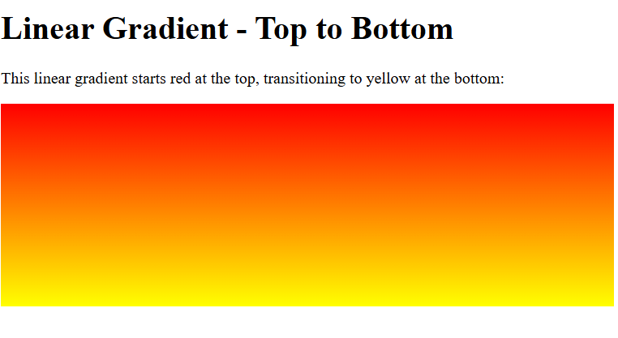
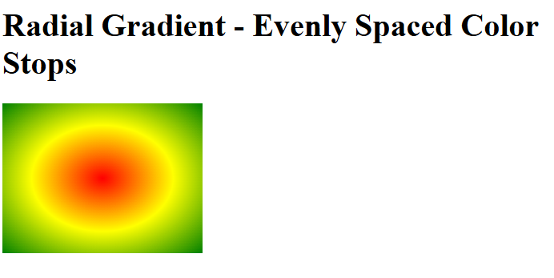
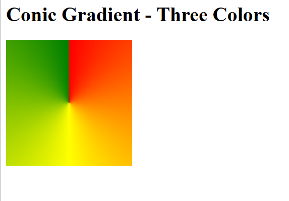

# CSS Gradients

## What are gradients?
Gradients are functions that create smooth color transitions, often used as backgrounds instead of flat colors.

## What are the types of gradients?
1) `linear-gradient()`
2) `radial-gradient()`
3) `conic-gradient()`

## What is `linear-gradient()`?
- Creates a gradient along a straight line.
- Syntax: `linear-gradient(direction, color-stop1, color-stop2, ...)`
- Direction can be an angle (`45deg`) or a keyword (`to right`, `to bottom left`).
- Default direction is `to bottom`.

Example:
```css
.hero {
  background: linear-gradient(to right, #4facfe, #00f2fe);
}
```

Example with multiple color stops:
```css
.card {
  background: linear-gradient(120deg, #ff9a9e 0%, #fad0c4 50%, #fad0c4 100%);
}
```

### Linear gradient HTML demo
```html
<!DOCTYPE html>
<html>
<head>
<style>
#grad1 {
  height: 200px;
  background-color: red; /* For browsers that do not support gradients */
  background-image: linear-gradient(to bottom, red, yellow);
}
</style>
</head>
<body>

<h1>Linear Gradient - Top to Bottom</h1>
<p>This linear gradient starts red at the top, transitioning to yellow at the bottom:</p>

<div id="grad1"></div>

</body>
</html>
```
Output: 

## What is `radial-gradient()`?
- Creates a gradient radiating from a center point outward.
- Syntax: `radial-gradient(shape size at position, start-color, ..., end-color)`
- Shape: `circle` or `ellipse` (default).
- Size: `closest-side`, `farthest-corner`, etc.

Example:
```css
.button {
  background: radial-gradient(circle at center, #ffecd2 0%, #fcb69f 100%);
}
```

### Radial gradient HTML demo
```html
<!DOCTYPE html>
<html>
<head>
<style>
#grad1 {
  height: 150px;
  width: 200px;
  background-color: red; /* For browsers that do not support gradients */
  background-image: radial-gradient(red, yellow, green);
}
</style>
</head>
<body>

<h1>Radial Gradient - Evenly Spaced Color Stops</h1>

<div id="grad1"></div>

</body>
</html>
```
Output: 

## What is `conic-gradient()`?
- Creates a gradient around a center in a circular rotation.
- Syntax: `conic-gradient(from angle at position, color-stop1, color-stop2, ...)`

Example:
```css
.badge {
  background: conic-gradient(from 90deg at 50% 50%, #ff6b6b 0deg 90deg, #feca57 90deg 180deg, #1dd1a1 180deg 270deg, #54a0ff 270deg 360deg);
}
```

### Conic gradient HTML demo
```html
<!DOCTYPE html>
<html>
<head>
<style>
#grad1 {
  height: 200px;
  width: 200px;
  background-color: red; /* For browsers that do not support gradients */
  background-image: conic-gradient(red, yellow, green);
}
</style>
</head>
<body>

<h1>Conic Gradient - Three Colors</h1>

<div id="grad1"></div>

</body>
</html>
```
Output: 

## How to stop/continue gradients with percentages
- Use explicit stops: `linear-gradient(to right, red 0%, yellow 50%, blue 100%)`
- Repeated colors can create hard stops: `radial-gradient(circle, red 0%, red 40%, transparent 40%, transparent 100%)`

## Can gradients be animated?
Yes, gradients can be animated using CSS animations by changing the background-position, angles, or stops over time.

Example:
```css
@keyframes gradientShift {
  0% { background-position: 0% 50%; }
  50% { background-position: 100% 50%; }
  100% { background-position: 0% 50%; }
}

.animated-gradient {
  background: linear-gradient(-45deg, #ff9a9e, #fad0c4, #fad0c4, #fbc2eb);
  background-size: 400% 400%;
  animation: gradientShift 8s ease infinite;
}
```

## What is browser support and prefixes for gradients?
Modern browsers support `linear-gradient`, `radial-gradient`, `conic-gradient` without prefixes. For very old browsers, use vendor prefixes (`-webkit-`, `-moz-`) and fallback background colors.

Example fallback:
```css
.card {
  background: #4facfe;
  background: linear-gradient(to right, #4facfe, #00f2fe);
}
```