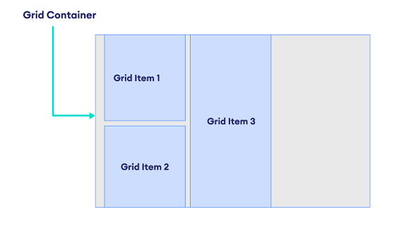
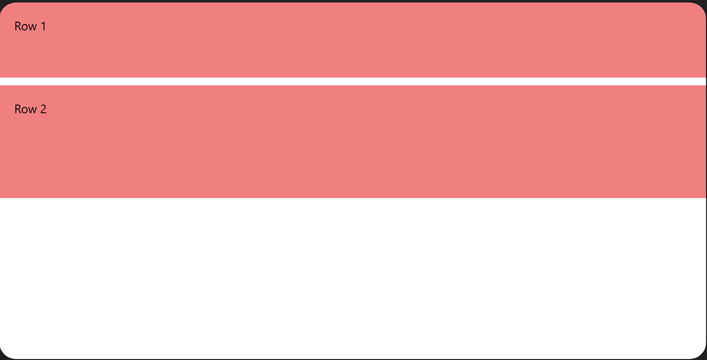
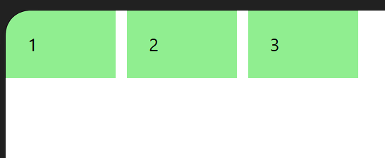
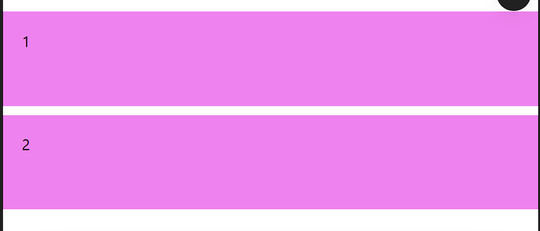
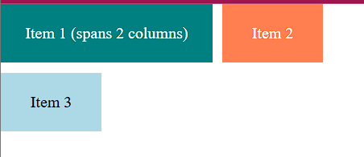
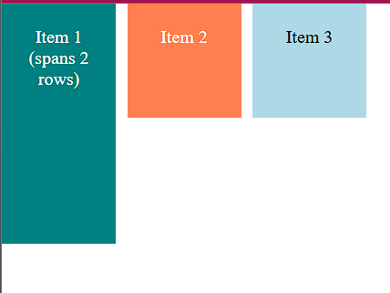
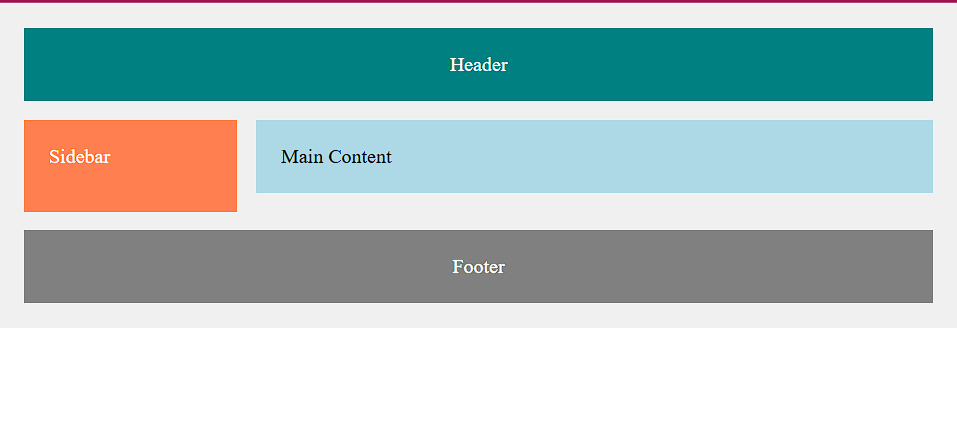

# CSS Grid

## What is CSS Grid?
CSS Grid Layout Module offers a grid-based layout system with rows and columns, making it easier to design web pages without using floats and positioning. Grid is a two-dimensional layout system that allows you to work with both rows and columns simultaneously.

## What are the core concepts of CSS Grid?
CSS Grid has two main core concepts:

1. **Grid Container** - The parent element that holds the grid system
2. **Grid Items** - The child elements inside the grid container


## What is a Grid Container?
An HTML element becomes a grid container when you set the `display: grid;` property on it. All direct children of the grid container become grid items.

Syntax ⇒
```css
.container {
  display: grid;
}
```

## What are Grid Columns?
Grid columns are the vertical lines of grid items. Columns run vertically from top to bottom and divide the grid horizontally into sections.

## What are Grid Rows?
Grid rows are the horizontal lines of grid items. Rows run horizontally from left to right and divide the grid vertically into sections.

## What are Grid Gaps?
Grid gaps are the spaces between each column and row. They help create visual separation between grid items.

Syntax ⇒
```css
.container {
  row-gap: 10px;    /* Space between rows */
  column-gap: 10px; /* Space between columns */
}
```

### What is the gap shorthand property?
The `gap` property is a shorthand for both `row-gap` and `column-gap`. A single value applies the same gap to both rows and columns.

Syntax ⇒
```css
.container {
  gap: 10px; /* 10px gap between all rows and columns */
}
```

## What are Grid Lines?
Grid lines are the dividing lines that make up the structure of the grid.

1. **Column Lines** - Vertical lines that separate columns
2. **Row Lines** - Horizontal lines that separate rows

---

# CSS Grid Container Properties

## What is grid-template-columns?
The `grid-template-columns` property defines the number of columns in your grid layout and the width of each column. The value is a space-separated list where each value defines the width of the respective column.

Syntax ⇒
```css
.container {
  grid-template-columns: auto auto auto;
  /* or */
  grid-template-columns: 100px 200px 300px;
  /* or */
  grid-template-columns: 1fr 2fr 1fr;
  /* or */
  grid-template-columns: 10% 20% 30%;
  /* or */
  grid-template-columns: repeat(3, 100px);
}
```
### Example
```html
<!DOCTYPE html>
<html>
<head>
<style>
.container {
  display: grid;
  grid-template-columns: 1fr 2fr 1fr;
  gap: 10px;
}
.item {
  background: lightblue;
  padding: 20px;
  text-align: center;
}
</style>
</head>
<body>

<div class="container">
  <div class="item">1</div>
  <div class="item">2</div>
  <div class="item">3</div>
</div>

</body>
</html>
```


### What do the different grid-template-columns values mean?
- **auto** - Automatically sizes column to fit content
- **100px** - Fixed pixel width
- **1fr** - Fractional unit (takes 1 part of available space)
- **10%** - Percentage of container width
- **repeat(3, 100px)** - Creates 3 columns of 100px each

## What is grid-template-rows?
The `grid-template-rows` property defines the height of each row in your grid layout. The values work the same way as grid-template-columns.

Syntax ⇒
```css
.container {
  grid-template-rows: auto auto auto;
  /* or */
  grid-template-rows: 100px 200px 300px;
  /* or */
  grid-template-rows: 1fr 2fr 1fr;
  /* or */
  grid-template-rows: 10% 20% 30%;
  /* or */
  grid-template-rows: repeat(3, 100px);
}
```
### Example 
```html
<!DOCTYPE html>
<html>
<head>
<style>
.container {
  display: grid;
  grid-template-rows: 100px 150px;
  gap: 10px;
}
.item {
  background: lightcoral;
  padding: 20px;
}
</style>
</head>
<body>

<div class="container">
  <div class="item">Row 1</div>
  <div class="item">Row 2</div>
</div>

</body>
</html>
```


### What is the repeat() function in Grid?
The `repeat()` function creates repetitive columns or rows. It takes two parameters: the number of repetitions and the size.

Example ⇒
```css
.container {
  grid-template-columns: repeat(3, 100px); /* 3 columns, each 100px */
  grid-template-rows: repeat(2, 150px);    /* 2 rows, each 150px */
}
```
### Example 
```html
<!DOCTYPE html>
<html>
<head>
<style>
.container {
  display: grid;
  grid-template-columns: repeat(3, 100px);
  gap: 10px;
}
.item {
  background: lightgreen;
  padding: 20px;
}
</style>
</head>
<body>

<div class="container">
  <div class="item">1</div>
  <div class="item">2</div>
  <div class="item">3</div>
</div>

</body>
</html>
```


## What is justify-content in Grid?
The `justify-content` property aligns the entire grid horizontally within the container (when the grid is smaller than the container width).

Syntax ⇒
```css
.container {
  justify-content: start|center|end|space-evenly|space-around|space-between;
}
```
### Example
```html
<!DOCTYPE html>
<html>
<head>
<style>
.container {
  display: grid;
  grid-template-columns: 100px 100px;
  justify-content: center;
  gap: 10px;
}
.item {
  background: orange;
  padding: 20px;
}
</style>
</head>
<body>

<div class="container">
  <div class="item">1</div>
  <div class="item">2</div>
</div>

</body>
</html>
```


### What do justify-content values do?
- **start** - Aligns grid to the left
- **center** - Aligns grid to the center
- **end** - Aligns grid to the right
- **space-evenly** - Equal space between and around grid
- **space-around** - Space around the grid items
- **space-between** - Space between grid items

## What is align-content in Grid?
The `align-content` property aligns the entire grid vertically within the container (when the grid is smaller than the container height).

Syntax ⇒
```css
.container {
  align-content: start|center|end|space-evenly|space-around|space-between;
}
```
### Example 
```html
<!DOCTYPE html>
<html>
<head>
<style>
.container {
  display: grid;
  grid-template-rows: 100px 100px;
  align-content: center;
  height: 300px;
  gap: 10px;
}
.item {
  background: violet;
  padding: 20px;
}
</style>
</head>
<body>

<div class="container">
  <div class="item">1</div>
  <div class="item">2</div>
</div>

</body>
</html>
```


### What do align-content values do?
- **start** - Aligns grid to the top
- **center** - Aligns grid to the center
- **end** - Aligns grid to the bottom
- **space-evenly** - Equal space between and around grid
- **space-around** - Space around the grid items
- **space-between** - Space between grid items

---

# CSS Grid Items Properties

## What is the grid-column property?
The `grid-column` property defines on which column(s) to place a grid item. You specify where the item starts and where it ends. This merges columns in the horizontal direction.

Syntax ⇒
```css
.item {
  grid-column: 1 / 3;     /* Spans from column 1 to column 3 */
  /* or */
  grid-column: 1 / span 2; /* Spans 2 columns starting from column 1 */
}
```

### What is the difference between grid-column syntax styles?
- **grid-column: 1 / 3** - Starts at column line 1 and ends at column line 3 (spans 2 columns)
- **grid-column: 1 / span 2** - Starts at column line 1 and spans 2 columns

Example ⇒
```html
<!DOCTYPE html>
<html lang="en">
<head>
  <meta charset="UTF-8">
  <meta name="viewport" content="width=device-width, initial-scale=1.0">
  <title>Grid Column</title>
  <style>
    .container {
      display: grid;
      grid-template-columns: repeat(3, 100px);
      gap: 10px;
    }
    .item1 {
      grid-column: 1 / 3;
      background-color: teal;
      color: white;
      text-align: center;
      padding: 20px;
    }
    .item2 {
      background-color: coral;
      color: white;
      text-align: center;
      padding: 20px;
    }
    .item3 {
      background-color: lightblue;
      text-align: center;
      padding: 20px;
    }
  </style>
</head>
<body>
  <div class="container">
    <div class="item1">Item 1 (spans 2 columns)</div>
    <div class="item2">Item 2</div>
    <div class="item3">Item 3</div>
  </div>
</body>
</html>
```


## What is the grid-row property?
The `grid-row` property defines on which row(s) to place a grid item. You specify where the item starts and where it ends. This merges rows in the vertical direction.

**Important:** Always define the column position first when merging rows.

Syntax ⇒
```css
.item {
  grid-column: 2;         /* Item in column 2 */
  grid-row: 1 / 3;        /* Spans from row 1 to row 3 */
  /* or */
  grid-row: 1 / span 2;   /* Spans 2 rows starting from row 1 */
}
```

### What is the difference between grid-row syntax styles?
- **grid-row: 1 / 3** - Starts at row line 1 and ends at row line 3 (spans 2 rows)
- **grid-row: 1 / span 2** - Starts at row line 1 and spans 2 rows

Example ⇒
```html
<!DOCTYPE html>
<html lang="en">
<head>
  <meta charset="UTF-8">
  <meta name="viewport" content="width=device-width, initial-scale=1.0">
  <title>Grid Row</title>
  <style>
    .container {
      display: grid;
      grid-template-columns: repeat(3, 100px);
      grid-template-rows: repeat(3, 100px);
      gap: 10px;
    }
    .item1 {
      grid-column: 1;
      grid-row: 1 / 3;
      background-color: teal;
      color: white;
      text-align: center;
      padding: 20px;
    }
    .item2 {
      background-color: coral;
      color: white;
      text-align: center;
      padding: 20px;
    }
    .item3 {
      background-color: lightblue;
      text-align: center;
      padding: 20px;
    }
  </style>
</head>
<body>
  <div class="container">
    <div class="item1">Item 1 (spans 2 rows)</div>
    <div class="item2">Item 2</div>
    <div class="item3">Item 3</div>
  </div>
</body>
</html>
```


## What is the grid-area property?
The `grid-area` property can be used to assign names to grid items. This makes it easier to place and organize items using named grid areas.

Syntax ⇒
```css
.item {
  grid-area: name_of_the_grid;
}
```

Example ⇒
```html
<!DOCTYPE html>
<html lang="en">
<head>
  <meta charset="UTF-8">
  <meta name="viewport" content="width=device-width, initial-scale=1.0">
  <title>Grid Area</title>
  <style>
    .container {
      display: grid;
      grid-template-columns: 1fr 1fr 1fr;
      grid-template-rows: auto;
      gap: 10px;
      margin: 10px;
    }
    #header {
      grid-area: header;
      background-color: teal;
      color: white;
      padding: 20px;
      text-align: center;
    }
    #aside {
      grid-area: aside;
      background-color: coral;
      color: white;
      padding: 20px;
      text-align: center;
    }
    #article {
      grid-area: article;
      background-color: lightblue;
      padding: 20px;
      text-align: center;
    }
  </style>
</head>
<body>
  <div class="container">
    <div id="header">Header</div>
    <div id="aside">Aside</div>
    <div id="article">Article</div>
  </div>
</body>
</html>
```


---

# Complete Grid Example

## What is a complete Grid layout example?

Here's a complete example showing how to use Grid properties together:

```html
<!DOCTYPE html>
<html lang="en">
<head>
  <meta charset="UTF-8">
  <meta name="viewport" content="width=device-width, initial-scale=1.0">
  <title>Complete Grid Example</title>
  <style>
    .container {
      display: grid;
      grid-template-columns: repeat(4, 1fr);
      grid-template-rows: auto auto auto;
      gap: 15px;
      padding: 20px;
      background-color: #f0f0f0;
    }
    
    .header {
      grid-column: 1 / 5;
      background-color: teal;
      color: white;
      padding: 20px;
      text-align: center;
    }
    
    .sidebar {
      grid-column: 1;
      grid-row: 2 / 4;
      background-color: coral;
      color: white;
      padding: 20px;
    }
    
    .main {
      grid-column: 2 / 5;
      background-color: lightblue;
      padding: 20px;
    }
    
    .footer {
      grid-column: 1 / 5;
      background-color: gray;
      color: white;
      padding: 20px;
      text-align: center;
    }
  </style>
</head>
<body>
  <div class="container">
    <div class="header">Header</div>
    <div class="sidebar">Sidebar</div>
    <div class="main">Main Content</div>
    <div class="footer">Footer</div>
  </div>
</body>
</html>
```


This creates a layout with a header spanning all columns, a sidebar on the left spanning multiple rows, and main content on the right.
