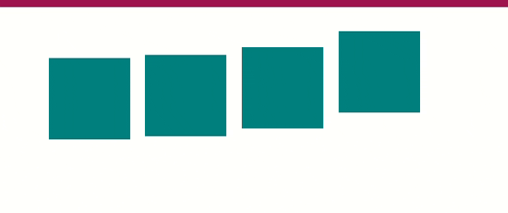

# CSS Transition

## What is CSS Transition?
A CSS transition occurs when a CSS property changes from one value to another value smoothly over a period of time. Transitions allow you to create smooth animations without using JavaScript or creating keyframe animations. They make property changes feel more natural and polished.

## What are the main CSS Transition Properties?
CSS provides four main transition properties:

1. **transition-property** - Specifies which CSS properties to animate
2. **transition-duration** - Specifies how long the transition takes
3. **transition-timing-function** - Specifies the speed curve of the transition
4. **transition-delay** - Specifies when the transition starts

---

# Transition-property

## What is transition-property?
The `transition-property` property allows you to select which CSS properties you want to animate during a transition. You can animate specific properties or all properties that change.

Syntax ⇒
```css
transition-property: property-name | all;
```

### Which properties can be transitioned?
Only properties with numeric or color values can be transitioned, such as:
- `color`, `background-color`
- `width`, `height`, `padding`, `margin`
- `opacity`
- `transform`
- `top`, `left`, `right`, `bottom`

Example ⇒
```css
.box {
  transition-property: background-color;
}

.box:hover {
  background-color: teal;
}
```

### What does transition-property: all do?
When you use `all`, every CSS property that changes will be animated.

Example ⇒
```css
.box {
  transition-property: all;
  width: 100px;
  height: 100px;
}

.box:hover {
  width: 200px;
  height: 200px;
}
```

---

# transition-duration

## What is transition-duration?
The `transition-duration` property specifies how long the transition effect takes to complete. It defines the time it takes for a CSS property to change from one state to another.

Syntax ⇒
```css
transition-duration: time;
```

### What time units are accepted for transition-duration?
- **s** - Seconds (e.g., `0.5s`, `2s`)
- **ms** - Milliseconds (e.g., `500ms`, `2000ms`)

Example ⇒
```html
<!DOCTYPE html>
<html lang="en">
<head>
  <meta charset="UTF-8">
  <meta name="viewport" content="width=device-width, initial-scale=1.0">
  <title>Transition Duration</title>
  <style>
    .box {
      width: 100px;
      height: 100px;
      background-color: teal;
      margin: 20px;
      transition-property: background-color;
      transition-duration: 1s;
    }
    .box:hover {
      background-color: coral;
    }
  </style>
</head>
<body>
  <div class="box">Hover me (1s)</div>
</body>
</html>
```


---

# Transition-timing-function

## What is transition-timing-function?
The `transition-timing-function` property specifies the speed curve of the transition effect. It determines how CSS properties change values over time, controlling the acceleration and deceleration of the transition.

Syntax ⇒
```css
transition-timing-function: linear|ease|ease-in|ease-out|ease-in-out;
```

### What is linear timing function?
`linear` - The transition has the same speed throughout the entire effect. It moves at a constant rate from start to finish.

Syntax ⇒
```css
.box {
  transition-timing-function: linear;
}
```

### What is ease timing function?
`ease` - The default value. The transition starts slowly, speeds up in the middle, and slows down at the end. This creates a natural, smooth feel.

Syntax ⇒
```css
.box {
  transition-timing-function: ease;
}
```

### What is ease-in timing function?
`ease-in` - The transition starts slowly and accelerates towards the end. Good for elements entering the screen.

Syntax ⇒
```css
.box {
  transition-timing-function: ease-in;
}
```

### What is ease-out timing function?
`ease-out` - The transition starts quickly and decelerates towards the end. Good for elements leaving the screen.

Syntax ⇒
```css
.box {
  transition-timing-function: ease-out;
}
```

### What is ease-in-out timing function?
`ease-in-out` - The transition starts slowly, speeds up in the middle, and slows down at the end. Similar to ease but more pronounced.

Syntax ⇒
```css
.box {
  transition-timing-function: ease-in-out;
}
```

Example ⇒
```html
<!DOCTYPE html>
<html lang="en">
<head>
  <meta charset="UTF-8">
  <meta name="viewport" content="width=device-width, initial-scale=1.0">
  <title>Timing Functions</title>
  <style>
    .container {
      display: flex;
      gap: 20px;
      margin: 50px;
      flex-wrap: wrap;
    }
    .box {
      width: 100px;
      height: 100px;
      background-color: teal;
      color: white;
      text-align: center;
      line-height: 100px;
      border: 1px solid black;
      transition-property: transform;
      transition-duration: 2s;
    }
    .linear:hover {
      transition-timing-function: linear;
      transform: translateX(200px);
    }
    .ease:hover {
      transition-timing-function: ease;
      transform: translateX(200px);
    }
    .ease-in:hover {
      transition-timing-function: ease-in;
      transform: translateX(200px);
    }
    .ease-out:hover {
      transition-timing-function: ease-out;
      transform: translateX(200px);
    }
    .ease-in-out:hover {
      transition-timing-function: ease-in-out;
      transform: translateX(200px);
    }
  </style>
</head>
<body>
  <div class="container">
    <div class="box linear">Linear</div>
    <div class="box ease">Ease</div>
    <div class="box ease-in">Ease-in</div>
    <div class="box ease-out">Ease-out</div>
    <div class="box ease-in-out">Ease-in-out</div>
  </div>
</body>
</html>
```


---

# Transition-delay

## What is transition-delay?
The `transition-delay` property specifies a delay before the transition effect begins. It defines a waiting period before the animation starts.

Syntax ⇒
```css
transition-delay: time;
```

### What time units are accepted for transition-delay?
- **s** - Seconds (e.g., `0.5s`, `2s`)
- **ms** - Milliseconds (e.g., `500ms`, `2000ms`)

Example ⇒
```html
<!DOCTYPE html>
<html lang="en">
<head>
  <meta charset="UTF-8">
  <meta name="viewport" content="width=device-width, initial-scale=1.0">
  <title>Transition Delay</title>
  <style>
    .container {
      display: flex;
      gap: 20px;
      margin: 50px;
    }
    .box {
      width: 100px;
      height: 100px;
      background-color: teal;
      color: white;
      text-align: center;
      line-height: 100px;
      border: 1px solid black;
      transition-property: background-color;
      transition-duration: 1s;
    }
    .box1 {
      transition-delay: 0s;
    }
    .box2 {
      transition-delay: 0.5s;
    }
    .box3 {
      transition-delay: 1s;
    }
    .box:hover {
      background-color: coral;
    }
  </style>
</head>
<body>
  <div class="container">
    <div class="box box1">No Delay</div>
    <div class="box box2">0.5s Delay</div>
    <div class="box box3">1s Delay</div>
  </div>
</body>
</html>
```
[![Transition delay video]](../Videos/transiotion/time_delay
)

---

# Transition Shorthand Property

## What is the transition shorthand property?
The `transition` shorthand property allows you to set all four transition properties in a single declaration: `transition-property`, `transition-duration`, `transition-timing-function`, and `transition-delay`.

Syntax ⇒
```css
transition: transition-property transition-duration transition-timing-function transition-delay;
```

### What is the order of values in the transition shorthand?
1. **transition-property** - Which property to animate
2. **transition-duration** - How long the transition takes
3. **transition-timing-function** - Speed curve
4. **transition-delay** - Delay before animation starts

Example ⇒
```css
.box {
  transition: all 0.5s linear 0.2s;
}
```

This means:
- Animate **all** properties
- Duration: **0.5s**
- Timing: **linear**
- Delay: **0.2s**

### Can you animate multiple properties with different durations?
Yes! You can comma-separate multiple transitions.

Syntax ⇒
```css
.box {
  transition: background-color 0.5s ease,
              width 1s linear,
              height 1s linear;
}
```

---

# Complete Transition Examples

## What is a complete transition example?

Example 1: Simple Color Transition ⇒
```html
<!DOCTYPE html>
<html lang="en">
<head>
  <meta charset="UTF-8">
  <meta name="viewport" content="width=device-width, initial-scale=1.0">
  <title>Color Transition</title>
  <style>
    .button {
      padding: 15px 30px;
      background-color: teal;
      color: white;
      border: none;
      font-size: 16px;
      cursor: pointer;
      transition: background-color 0.3s ease;
    }
    .button:hover {
      background-color: coral;
    }
  </style>
</head>
<body>
  <button class="button">Hover Me</button>
</body>
</html>
```


Example 2: Multiple Property Transitions ⇒
```html
<!DOCTYPE html>
<html lang="en">
<head>
  <meta charset="UTF-8">
  <meta name="viewport" content="width=device-width, initial-scale=1.0">
  <title>Multiple Transitions</title>
  <style>
    .box {
      width: 150px;
      height: 150px;
      background-color: teal;
      margin: 50px;
      transition: all 0.5s ease;
    }
    .box:hover {
      width: 200px;
      height: 200px;
      background-color: coral;
      transform: rotate(10deg);
    }
  </style>
</head>
<body>
  <div class="box"></div>
</body>
</html>
```


Example 3: Staggered Transitions with Delay ⇒
```html
<!DOCTYPE html>
<html lang="en">
<head>
  <meta charset="UTF-8">
  <meta name="viewport" content="width=device-width, initial-scale=1.0">
  <title>Staggered Transitions</title>
  <style>
    .container {
      display: flex;
      gap: 15px;
      margin: 50px;
    }
    .box {
      width: 80px;
      height: 80px;
      background-color: teal;
      transition: transform 0.5s ease;
    }
    .box1 {
      transition-delay: 0s;
    }
    .box2 {
      transition-delay: 0.1s;
    }
    .box3 {
      transition-delay: 0.2s;
    }
    .box4 {
      transition-delay: 0.3s;
    }
    .container:hover .box {
      transform: translateY(-50px);
    }
  </style>
</head>
<body>
  <div class="container">
    <div class="box box1"></div>
    <div class="box box2"></div>
    <div class="box box3"></div>
    <div class="box box4"></div>
  </div>
</body>
</html>
```


---

## Important Notes About Transitions

- **Transitions only work on state changes** - They need a trigger like `:hover`, `:focus`, `:active`, or a class change
- **Not all properties can be transitioned** - Only properties with numeric or color values work (not `display` or `visibility`)
- **Default duration is 0s** - If you don't specify a duration, the transition happens instantly
- **Multiple transitions can overlap** - You can animate different properties with different durations simultaneously
- **Use transitions for simple, quick animations** - For complex animations, use `@keyframes` instead
