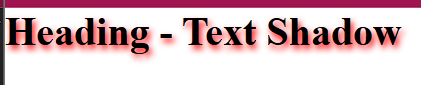
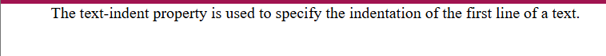
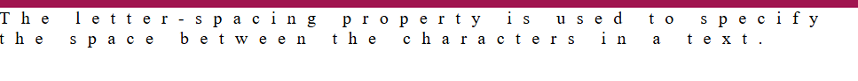
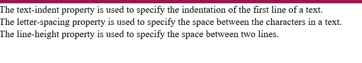
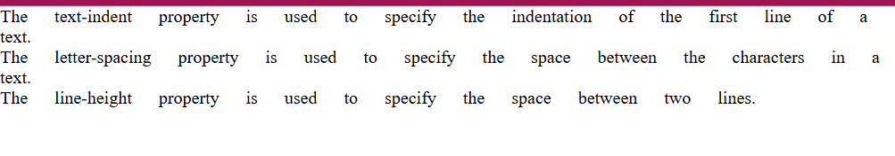

# CSS Text Properties

## What is CSS text formatting?
CSS text formatting refers to applying styles to text elements to control appearance and layout.
Appearance in the sense we can provide text color, decoration, shadows, etc.
And we can provide layout for the text with the help of alignment, indentation, justification, spacing and direction.

Syntax ⇒
```css
Selector {
  property : value;
}
```

## What is text color in CSS?
The color property is used to set the color of the text.
The color is specified by:
1. By a color name ⇒ red, blue, etc.
2. By a HEX value ⇒ #ffffff, #ff0000, etc.
3. An RGB value ⇒ rgb(255,0,0)

## What is text shadow in CSS?
The text-shadow property adds shadow to the text.
In its simplest use, you only specify the horizontal shadow and the vertical shadow

```html
<!DOCTYPE html>
<html lang="en">
<head>
  <meta charset="UTF-8" />
  <meta name="viewport" content="width=device-width, initial-scale=1.0" />
  <title>Text Shadow</title>
  <style>
    h1 {
      text-shadow: 2px 3px 5px red;
    }
  </style>
</head>
<body>
  <h1>Heading - Text Shadow</h1>
</body>
</html>
```


## What is text alignment in CSS?

The text-align property is used to set the horizontal alignment of a text. A text can be left or right aligned, centered, or justified.

Syntax ⇒
```css
text-align: left|right|center|justify|initial|inherit;
```

## What is text decoration in CSS?

The text-decoration property is a shorthand property for setting the decoration of text. It can include line, color, style, and thickness.

Syntax ⇒
```css
h1 {
  text-decoration : line color style thickness;
}
```

Following are the some text-decoration related properties:

1. **text-decoration-line** ⇒
   The text-decoration-line property is used to add a decoration line to text.
   Syntax ⇒
   ```css
   text-decoration-line : underline|line-through|overline
   ```

2. **text-decoration-color** ⇒
   The text-decoration-color property is used to set the color of the decoration.
   Syntax ⇒
   ```css
   text-decoration-color : red;
   ```

3. **text-decoration-style** ⇒
   The text-decoration-style property is used to set the style of the decoration line.
   Syntax ⇒
   ```css
   text-decoration-style : solid|double|dotted|dashed|wavy;
   ```

4. **text-decoration-thickness** ⇒
   The text-decoration-thickness property is used to set the thickness of the decoration line.
   Syntax ⇒
   ```css
   text-decoration-line : underline;
   text-decoration-thickness : auto|5px|25%
   ```

5. **text-decoration** ⇒
   The text-decoration property is a shorthand property.
   Syntax ⇒
   ```css
   h1 {
     text-decoration : line color style thickness;
   }
   ```

## What is text transformation in CSS?
The text-transform property is used to specify uppercase and lowercase letters in a text.
Syntax ⇒
```css
text-transform : uppercase|lowercase|capitalize;
```

## What is text spacing in CSS?

Following are the some text-spacing related properties:

1. **text-indent** ⇒
   The text-indent property is used to specify the indentation of the first line of a text.

   Example ⇒
   ```html
   <!DOCTYPE html>
   <html lang="en">
   <head>
     <meta charset="UTF-8">
     <meta name="viewport" content="width=device-width, initial-scale=1.0">
     <title>Text Indentation</title>
     <style>
       p {
         text-indent: 50px;
       }
     </style>
   </head>
   <body>
     <p>The text-indent property is used to specify the indentation of the first line of a text.</p>
   </body>
   </html>
   ```


2. **letter-spacing** ⇒
   The letter-spacing property is used to specify the space between the characters in a text.

   Example ⇒
   ```html
   <!DOCTYPE html>
   <html lang="en">
   <head>
     <meta charset="UTF-8">
     <meta name="viewport" content="width=device-width, initial-scale=1.0">
     <title>Document</title>
     <style>
       p {
         letter-spacing: 10px;
       }
     </style>
   </head>
   <body>
     <p>The letter-spacing property is used to specify the space between the characters in a text.</p>
   </body>
   </html>
   ```


3. **line-height** ⇒
   The line-height property is used to specify the space between two lines.

   Example ⇒
   ```html
   <!DOCTYPE html>
   <html lang="en">
   <head>
     <meta charset="UTF-8">
     <meta name="viewport" content="width=device-width, initial-scale=1.0">
     <title>Document</title>
     <style>
       p {
         line-height: 20px;
       }
     </style>
   </head>
   <body>
     <p>The text-indent property is used to specify the indentation of the first line of a text.</p>
     <p>The letter-spacing property is used to specify the space between the characters in a text.</p>
     <p>The line-height property is used to specify the space between two lines.</p>
   </body>
   </html>
   ```


4. **word-spacing** ⇒
   The word-spacing property is used to specify the space between the words in a text.

   Example ⇒
   ```html
   <!DOCTYPE html>
   <html lang="en">
   <head>
     <meta charset="UTF-8">
     <meta name="viewport" content="width=device-width, initial-scale=1.0">
     <title>Document</title>
     <style>
       p {
         word-spacing: 20px;
       }
     </style>
   </head>
   <body>
     <p>The text-indent property is used to specify the indentation of the first line of a text.</p>
     <p>The letter-spacing property is used to specify the space between the characters in a text.</p>
     <p>The line-height property is used to specify the space between two lines.</p>
   </body>
   </html>
   ```
