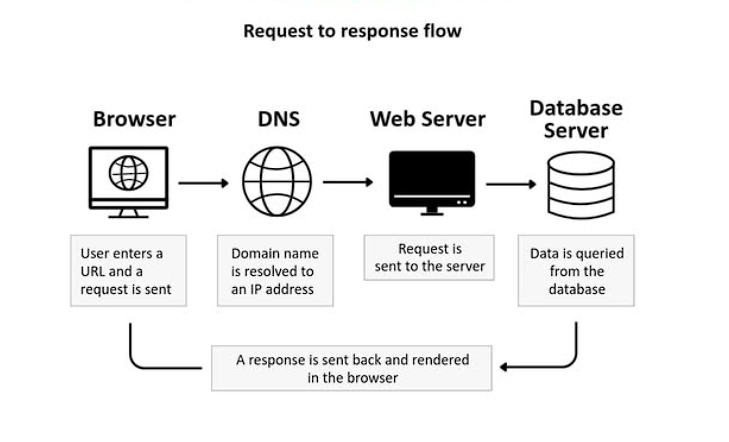

# Web Technology

## What is web?
The collection of information which can be accessed through the internet which we also define it as WORLD WIDE WEB

## What is web page?
The single HTML document which can be accessed through the internet is known as web page

## What is website?
The collection of multiple webpage is called as website

## What is software?
Set of instructions, data, or programs that tell a computer or electronic device how to operate and perform specific tasks

## What are types of software?
There are 2 types of software:
1) System software : Acts as an intermediary between the hardware and the application software
2) Application software : Software designed to perform specific tasks for the user

## What is HTTP?
It is a protocol used to send requests and receive responses. Full form is Hyper Text Transfer Protocol
### HTTPS - s stands for secure

## What is URL?
The web address of a resource on the internet, such as web page, image or document.

## What is DNS?
It will convert url format into IP address format

## What is server?
A server is a computer or a system that provides resources, data and services to other computers known as clients over a network.

## What are the components of the browser?
There are 7 components of the browser those are: 
1) User Interface (UI): Everything you see besides the window content, including the address bar, bookmark bar, back/forward buttons, and settings.
2) Browser Engine: Acts as a bridge between the User Interface and the Rendering Engine, acting as a broker that initiates actions.
3) Rendering Engine: Responsible for displaying requested content. It parses HTML and CSS, rendering it on the screen. Examples include Blink (Chrome), Gecko (Firefox), and WebKit (Safari).
4) Networking: Handles network calls (HTTP/HTTPS) and security, fetching web resources and managing connectivity.
5) JavaScript Interpreter (or Engine): Parses and executes JavaScript code to create dynamic, interactive behavior on web pages.
6) UI Backend: Used for drawing basic widgets like combo boxes and windows. It uses the operating system's user interface methods.
7) Data Storage (Persistence): A persistence layer that stores data locally on the user's computer, such as cookies, bookmarks, history, and cache.

## How does the internet works?

*Figure: Image explains how the internet works*

---

## Navigation Guide

**Complete HTML Documentation:**
- **[HTML Main Guide](Html.md)** - Complete HTML documentation index
- **[HTML Basics](Html_Basics.md)** - HTML structure and basic tags
- **[HTML Attributes](Html_Attributes.md)** - Core HTML attributes
- **[HTML Content](Html_Content.md)** - Formatting, links, images, lists, tables
- **[HTML Forms](Forms.md)** - Form elements and input validation
- **[HTML Multimedia](Multimedia.md)** - Video and audio embedding
- **[HTML Advanced](Html_Advanced.md)** - HTML5 features and accessibility

**Web Technology Topics Covered:**
- Web concepts (pages, websites, and the internet)
- Software types (system and application)
- HTTP/HTTPS protocols
- URLs and domain names
- DNS and domain resolution
- Server-client architecture
- Browser components and rendering
- How the internet works
- Data storage and persistence